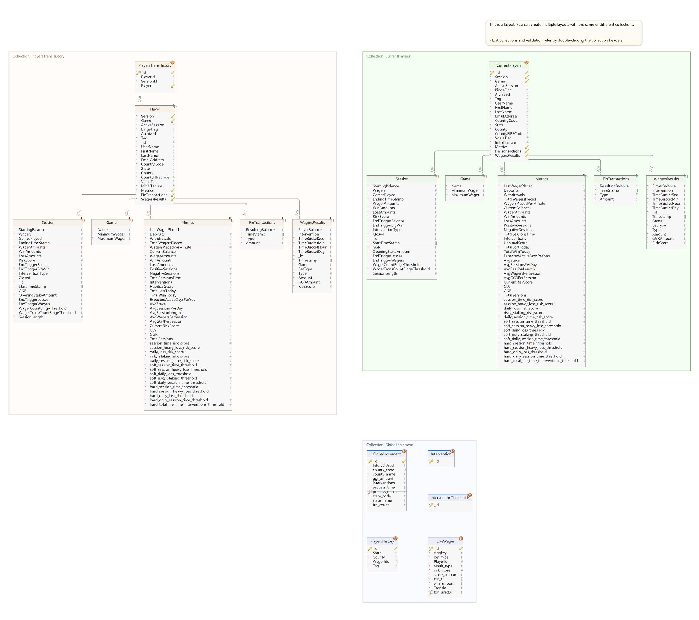

# Safe Gaming Applications

The Safe Gaming applications consist of three separate applications. They are:

-   Safe Gaming Simulator (GameSimulator) – This application simulates a casino with gambling (games), players, player sessions, etc. This application drives the data used by the remining applications.
-   Safe Gaming Dashboard (GameDashBoard) – This is a read-only console application driven by the output from Game Simulator. It simulators a high-level casino dashboard. It reads all global session overview, player wagers, player interventions, and detailed player information.
-   Safe Gaming GUI – This is an interactive casino application where players place bets against the simulator.

These applications can run on any OS (Windows, MacOS, and Linux).

The Safe Gaming Simulator and Safe Gaming Dashboard applications can target different databases following the same document model and providing the same functionality/behavior. The following are the current databases supported:

-   AerospikeDB (AS)
-   MongoDB (MG)

Each database target will be in a separate folder (they do share a common set of code except for the database component and configuration) based on the database name and the executable will be suffixed with the database abbreviation (e.g., GameDashBoardAS for Aerospike).

These applications are not data generators but instead simulate roulette and slot machine play using gaming industry rules, statistics, and data. This includes player data based on geographic and financial data.

## Overview

Safe Gaming performs true inserts, updates, and atomic operations against seven different Sets (tables) concurrently with true realistic varying payloads. The action rates performed against these Sets (tables) even vary to simulate more realistic patterns.

Safe Gaming also has a read workload to simulate business dashboards. The read workload performs queries (with and without the use of secondary indexes) and Gets (read by PK).

The Safe Gaming Dashboards can be running concurrent to the Gaming Simulator resulting in real time dashboard updates or in "historic" mode simulating "real time" against existing data. This application reads from four Sets (tables) concurrently and simulate “drill-down” by obtaining additional more detail data.

This is why Safe Gaming is drastically different from many other tools like ASBench, and YCSB. These tools use static artificial payloads against a single Set (table) using one, maybe two, DB action(s) for either reads or writes. Neither perform query operations. Because of this and other factors, this type of workload is not found in a typical customer's ecosystem.

As such, it consists of a true document model that represents multiple facets (documents/objects) of gaming. They are:

-   Player represents a person playing a game. It has the following associates:
    -   Information
        -   Name, email, etc.
    -   Geographics  
        Based on where gaming is allowed, Census data, and algorithms.
    -   Financial data including:
        -   Income  
            Determined by geographic location, media income, population, etc. based on US Census data.
        -   Account balances
        -   History
    -   Games Play
        -   Games Played
        -   Play Amounts (wagers)
        -   Win/Loss
        -   Turn Time Play  
            The amount of time it takes a player to play one turn.
        -   History
    -   Sessions
        -   Games
        -   Win/Loss
        -   Account balances
        -   History
-   Games
    -   Roulette or Slot Machines (can be expanded to other games like game Crafts)
    -   Rules
    -   Algorithms
    -   Time Play  
        Simulates the time it takes to perform one play for the game.

There are eleven different documents in the model. Below is an overview of the model:

Note: This document will not go into detail about each document, nor processing logic.

The application has two basic operational modes. They are:

-   Historic
-   Real Time

### Historic Mode

In historic mode all timestamps are simulated in the past, the application will simulate play following all rules producing realistic “backfilled” information for the database. The application will run as fast as possible (doesn’t sleep for game play).

### Real Time Mode

In real time mode all players and game play occur in real time. All game plays and player turn play are simulated in real time producing clock time timestamps. This mode is typically used to drive the SafeGaming GUI application and GameDashBoard application.

## Installation

### Self-Contained

A packaged version will contain all required runtime libraries and can be executed directly from where it is installed.

### Build

To be able to build the application, follow these steps:

1.  Install [.Net 7.0 SDK](https://dotnet.microsoft.com/en-us/download/dotnet/7.0)
2.  Clone the [SafeGaming](https://github.com/citrusleaf/par-eng-team/tree/main/workloads/safegaming) GitHub Repo
3.  Go to the appropriate folder, to build the executable. Below is the project/folder breakdown:
    1.  Game Simulator, used to run the simulator and populate the database.
        1.  Aerospike – The version that targets the Aerospike DB
        2.  Mongo – The version that targets the Mongo DB
    2.  Game Dashboard, used to run the console dashboard application.
        1.  Aerospike – The version that targets the Aerospike DB
        2.  Mongo – The version that targets the Mongo DB
    3.  Once in the appropriate folder, there will be two scripts. They are:
        1.  Publishrelease.sh – This will build and produce a self-contained version of the application. This version can be run on the targeted OS where it was built.
        2.  Publishrelease-linux.sh – This will build and produce an executable that can be ran on any Linux environment.
        3.  You can use the [dotnet](https://learn.microsoft.com/en-us/dotnet/core/tools/dotnet) command to manually build the applications.

## Configuration

The configuration is defined in the appsettings.json file. This file has multiple sections depending on the application being executed. You can place all the configurations for each application in one appsettings.json file. In this manner, the file can be shared between the applications. The json sections are:

-   *Top-Level* section
    -   This section will contain all the properties that are common between all the applications.
    -   *GameSimulator* or *GameDashBoard* section
        -   This section contains the properties associated with these application types.
        -   *Aerospike* or *Mongodb* section
            -   This section contains the properties associated with their C\# version of their database driver. There can be sub-sections under these sections based on the requirements of the driver and application.

### Property Value Usage

The appsettings.json file follows the standard syntax of JSON. Below are the behaviors of how the applications parse the configuration:

-   null value of a property will indicate the usage of the default value defined by the driver or application. Example:  
    *"LoggingSettings": null*
-   If the property is associated with a C\# class, the properties defined in that class can be used within the configuration file. For example, the Mongo JSON property, “DriverSettings” is associated with the Mongo driver class “MongoClientSettings”. As such, any of the public fields defined in that class can be used in the configuration file. Example:  
    *"ConnectTimeout": “5 seconds”*
-   Special Handling
    -   Date, Date Time, and Date Time Offset  
        Any property that takes a date time w/wo offset can be passed as an ISO 8601 format or any .Net [DateTime/DateTimeOffset Parse format](https://learn.microsoft.com/en-us/dotnet/standard/base-types/parsing-datetime). Example:  
        *"HistoricFromDate": "2023-08-01T00:00:00.0000+00"*
    -   Time/TimeSpan  
        Any property that takes a time span, a string with the numeric value and unit of time can be given. If a numeric value (not a string) is given, that will be treated as in milliseconds. Below are the unit of time values (not case sensitive):
        -   Day, Days, d
        -   Hours, Hour, hr, hrs, h
        -   Minutes, Minute, Min, Mins, m
        -   Seconds, Second, Sec, Secs, s
        -   Milliseconds, Millisecond, msecs, msec, ms
        -   Nanoseconds, Nanosecond, nsecs, nsec, nano, ns
        -   Microseconds, Microsecond, usecs, usec, us
        -   [Ticks](https://learn.microsoft.com/en-us/dotnet/api/system.datetime.ticks?view=net-7.0), Tick, t

            Note: If the JSON property has the unit of time in the name, you should provide a numeric value representing that unit of time.  
            Example:  
            *"MaxPlayerSessionRestTriggerMins": 240* – 240 minutes (unit of time in the name)  
            *"PlayTimeIntervalMinSecs": 6* – 6 seconds (unit of time in the name)  
            *"ConnectTimeout": “5 minutes”* – 5 minutes  
            *"ConnectTimeout": 5* – 5 **milliseconds** (since no unit of time  
            provides, defaults to milliseconds)

-   A null value of a JSON property indicates that the value should be ignored. The associated property’s default value in the application is used. Example:  
    *“ConnectTimeout”: null* -- use the default value in the application (property is ignored).
-   Property special string are values that translate into some other value in the application. Special Values are:
    -   “\<null\>” – transactions to an actual null value in the application. Actual null value indicates that the JSON property will be ignored (the default value in the application will be used). Example:  
        *"HGRMFile": “\<null\>”* -- An actual null value is passed to the field in the application.
    -   “\<ignore\>” – Like a null value, the property is ignored.
    -   “\<default\>” – The C\# default value for the field in the application based on data type is used.
    -   “\<empty\>” – An empty string is passed to the field in the application.
    -   “\#” – If the hash character is passed as the first element in a string, it is treated as a comment and is ignored. Example:  
        *"HGRMFile": “\#This is a file where the Histogram will be stored”*

\<not finished\>

## Command Line

Each application will have the capabilities to override certain properties defined in the application configuration file. What can be overridden will depend on the targeted database version. To obtain a list of possible arguments, pass “-?” to the executable. It will list the argument, default value, and description of each argument.

## Execution

There will be an executable in the targeted folder. Based on the functionality and targeted database you just call the application by its name. For example, GameDashBoardAS for the dashboard application targeting Aerospike. GameSimulatorMG for the game simulator application targeting MonogoDB. No file extension is required or calling the “dotnet” CLI.

Note for Linux or MacOS, you may need to change the access mode of a file to allow execution.
